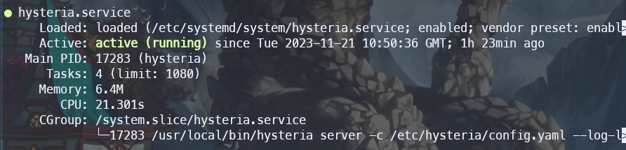
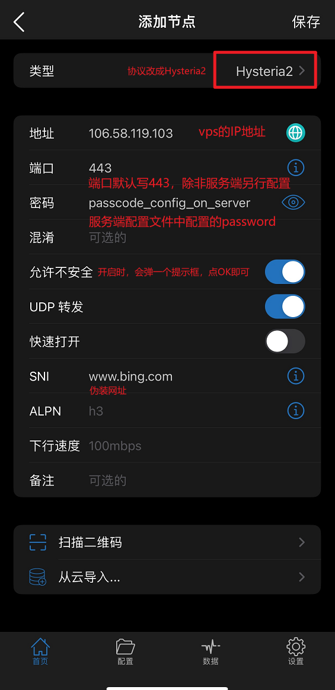
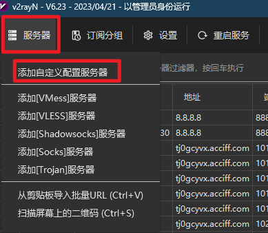
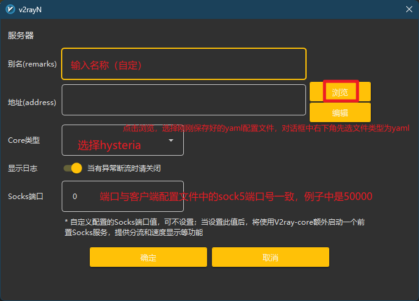

tags:: hysteria, 科学上网

- ## 官网
	- [Home - Hysteria 2](https://v2.hysteria.network/)
- ## 服务端配置
	- 一般配置在Linux服务器上
	- ### 安装Hysteria2
	  id:: 655c55fe-bb6e-4881-80d9-de3cee348a63
		- 安装或升级到最新版本：
			- ```bash
			  bash <(curl -fsSL https://get.hy2.sh/)
			  ```
		- 安装或升级为指定版本（跳过版本检查）：
			- ```bash
			  bash <(curl -fsSL https://get.hy2.sh/) --version v2.2.0
			  ```
		- 移除 Hysteria：
			- ```bash
			  bash <(curl -fsSL https://get.hy2.sh/) --remove
			  ```
	- ### 申请一个自己的证书
		- 步骤参考：[[使用acme.sh申请证书]]
		- 申请成功后，会产生两个文件：
			- 一个证书文件`*.cer`
			  id:: 655ec0ac-31e4-46e5-840a-dcbcce9aca45
			- 一个密钥文件`*.key`
		- 记住这两个文件存放的位置，后面配置需要用到
	- ### 获取证书的pinSHA256
	  id:: 655ec644-b8b6-42ca-b2d5-6265b076b315
		- 在vps中输入下面的命令：
			- ```bash
			  openssl x509 -noout -fingerprint -sha256 -in /root/.acme.sh/www.yourdomain.com_ecc/www.yourdomain.com.cer
			  ```
		- 输入完之后，会返回证书的SHA256码，复制`sha256 Fingerprint=`右边的内容即可
	- ### 配置服务端
		- 配置文件地址：`/etc/hysteria/config.yaml`
		- 根据你是想使用 ACME 自动获取域名的 TLS 证书，还是使用自己的证书，你可以使用以下其中一个模板。
		- **请确保用你自己的值（特别是密码）替换这些示例内容。**
		- 下面是使用自己证书的配置示例
			- ```yaml
			  # listen: :443
			  
			  tls:
			    cert: /root/.acme.sh/www.tsunari.cc_ecc/www.tsunari.cc.cer
			    key: /root/.acme.sh/www.tsunari.cc_ecc/www.tsunari.cc.key
			  
			  auth:
			    type: password
			    password: yourpasscode
			  
			  masquerade:
			    type: proxy
			    proxy:
			    	# 这个就是伪装的地址，每次发请求都会转发一份给这里，请求返回内容，用于欺骗
			      url: https://news.ycombinator.com/ 
			      rewriteHost: true
			  ```
		- 其他部分的说明可参考：[服务端 - Hysteria 2](https://v2.hysteria.network/zh/docs/getting-started/Server/)
	- ### 配置服务
		- hysteria执行时，需要一直占用控制台，且无法开机自启动，需要将其制作成一个服务，方便后台运行及配置开机自启
		- 通过执行下面命令，下载systemctl配置
			- ```bash
			  curl -Lo /etc/systemd/system/hysteria.service https://raw.githubusercontent.com/chika0801/hysteria-install/main/hysteria.service && systemctl daemon-reload
			  ```
		- 修改下载好的配置文件，改成如下所示，位置在`/etc/systemd/system/hysteria.service`
			- ```ini
			  [Unit]
			  After=network.target nss-lookup.target
			  
			  [Service]
			  User=root
			  WorkingDirectory=/root
			  CapabilityBoundingSet=CAP_NET_ADMIN CAP_NET_BIND_SERVICE
			  AmbientCapabilities=CAP_NET_ADMIN CAP_NET_BIND_SERVICE
			  ExecStart=/usr/local/bin/hysteria server -c /etc/hysteria/config.yaml --log-level debug
			  Restart=on-failure
			  RestartSec=10
			  LimitNPROC=512
			  LimitNOFILE=infinity
			  
			  [Install]
			  WantedBy=multi-user.target
			  ```
		- 参考：[chika0801/hysteria-install: Hysteria 2 安装指南 (github.com)](https://github.com/chika0801/hysteria-install)
	- ### 启动
		- 启动Hysteria
			- ```bash
			  systemctl enable --now hysteria
			  ```
		- 配置系统自启动
			- ```bash
			  systemctl enable hysteria-server.service
			  ```
		- 查看Hysteria执行状态
			- ```bash
			  systemctl status hysteria
			  ```
			- 看到状态是`active (running)`时，说明服务已经正常开启了
				- 
- ## 客户端配置
	- ### Shadowrocket
		- 1）打开Shadowrocket app，点击右上角的`＋`，进入配置界面
		- 2）按照下图填入服务端的配置信息：
			- 
		- 3）保存配置，打开科学上网开关，即可工作
	- ### V2rayN
		- #### 下载并替换hysteria-core文件
			- 1）访问[Releases · apernet/hysteria (github.com)](https://github.com/apernet/hysteria/releases)，找到Hysteria的最新版本
			- 2）如果是windows平台的V2rayN客户端的话，就下载`hysteria-windows-amd64.exe`
			- 3）如果V2rayN目前时启动状态的话，先将其关闭
			- 4）将下载好的文件，拷贝到`/<v2rayN_dir>/bin/hysteria`目录下，替换原有的文件
		- #### 编辑V2rayN的配置文件
			- 1）新建一个文件，命名为`hy2.yaml`
			- 2）复制下面内容到这个文件中，并保存
				- ```yaml
				  server: your.domain.net:443 
				  
				  auth: your_password
				  
				  tls:
				    tls:
				    insecure: true
				    pinSHA256: BA:88:45:17:A1...
				  
				  socks5:
				    listen: 127.0.0.1:50000
				  ```
				- 其中`pinSHA256`字段，填入上面[获取证书的pinSHA25](((655ec644-b8b6-42ca-b2d5-6265b076b315)))步骤生成的内容即可
		- #### 新建并导入配置文件
			- 1）打开V2rayN主界面，点击`服务器`，选择`添加自定义配置服务器`
				- 
			- 2）按照下图所示配置
				- 
			- 3）点击确定后，开启科学上网开关，即可使用