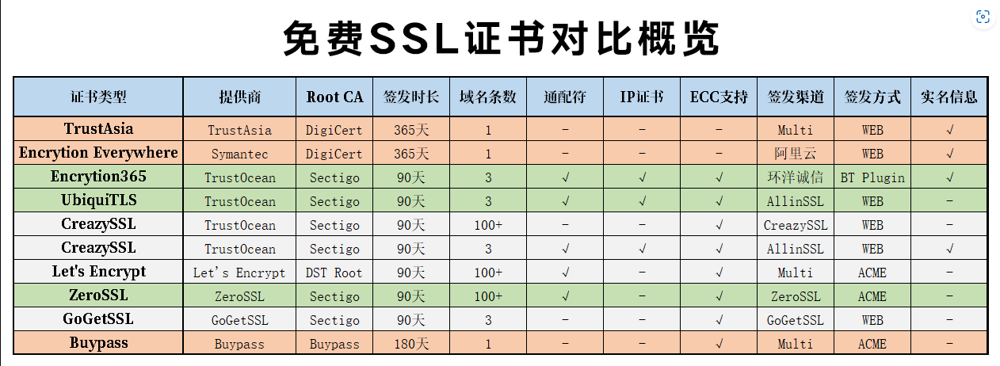

- {{renderer :tocgen2}}
- ## 参考链接
	- 本文主要参考自：[acme.sh申请证书之不完全版 - Hogwarts (winamp.top)](https://winamp.top/93.html)
	- acme项目：[acmesh-official/acme.sh: A pure Unix shell script implementing ACME client protocol (github.com)](https://github.com/acmesh-official/acme.sh)
	- SSL免费证书：[【杂谈】免费SSL证书那点事 – Luminous' Home (luotianyi.vc)](https://luotianyi.vc/4839.html)
	- ZeroSSL证书：[放弃Let's Encrypt证书，全站更换ZeroSSL证书 - 饭饭's Blog (ffis.me)](https://ffis.me/archives/2110.html)
- ## 申请前的准备工作
	- ### 安装工具
		- ```bash
		  apt-get install cron socat curl wget
		  ```
	- ### 安装acme.sh
		- ```bash
		  #把youremail@example.com改为你的邮箱
		  wget -O -  https://get.acme.sh | sh -s email=youremail@example.com
		  ```
	- ### 重启终端
		- ```bash
		  source ~/.bashrc
		  ```
	- ### 升级版本
		- ```bash
		  acme.sh --upgrade #安装一段时间后，申请证书前需更新一下
		  ```
- ## 申请ZeroSSL证书
	- ### 自动验证DNS方式
		- #### 特性
			- 不能为.ml、.tk、cf、.ga、.gq等免费域名
			- 可申请泛域名
			- 不需停掉cloudflare保护
			- 不需关闭nginx,caddy等web软件（443,80端口占用无视）
		- #### 前期准备
			- 登录cloudflare后，点右上角图标下的”我的个人资料”——“API令牌”——Global API Key“查看”
			- 输入你的密码，获取您的key，妥善保管
		- #### 申请命令
			- 生成到默认路径
				- ```bash
				  # Could replace the domain name to yours
				  acme.sh --issue --dns dns_cf -d www.yourdomain.com -k ec-256
				  ```
			- 安装到指定位置
				- ```bash
				  # 建立文件夹存放申请的证书、密钥
				  mkdir  /etc/www.yourdomain.com
				  # 生成到指定路径
				  acme.sh --ecc --installcert -d www.yourdomain.com  --key-file /etc/www.yourdomain.com/private.key  --fullchain-file /etc/www.yourdomain.com/fullchain.cer
				  ```
		- #### TroubleShooting
			- 人云亦云的推荐ZeroSSL证书证书，在实际操作申请过程中，有时还是有问题的。尤其对于非常规域名会申请失败。如果证书申请失败的话，可以尝试在命令后面加上默认的服务器，可能就会申请成功。
				- ```bash
				  # 比如下列命令，设置letsencrypt为申请服务器
				  acme.sh --issue -d www.yourdomain.com  --keylength ec-256  --standalone --server letsencrypt
				  ```
- ## Notes
	- 本例中以Cloudflare域名解析为前提。
	- 申请多个域名，再加上“`-d 你的域名`”选项即可。
	- 申请多个二级域名或多个三级域名会生成一个证书，共用。
	- 本例中申请的为ECC证书，申请一般证书不适用此文。
	- 不支持免费域名申请泛域名。
	- PS：申请泛域名证书只能用dns方式。
- ## 免费SSL证书对比
	- 